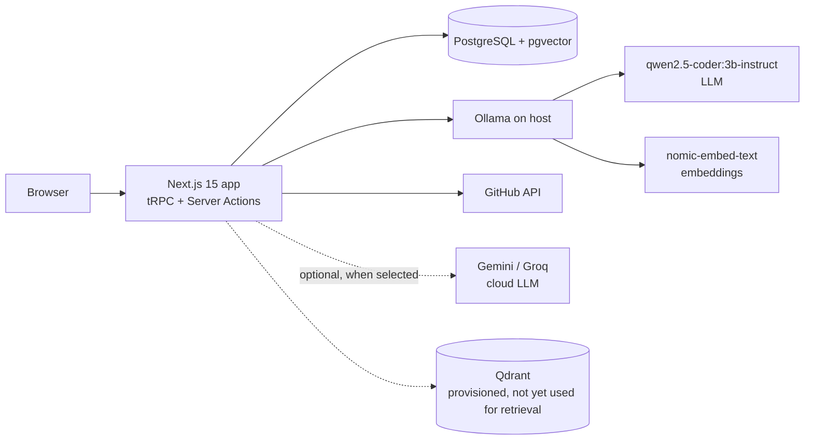
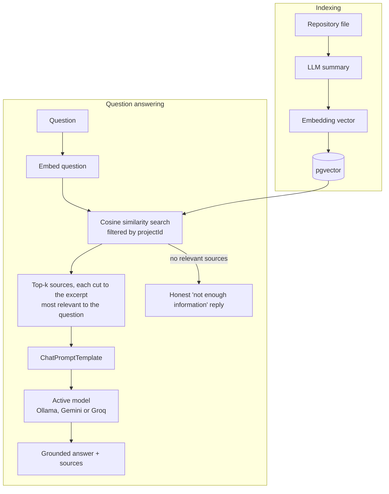

# CodeMind — AI Codebase Engineer

**Understand. Search. Debug. Test. Improve.**

CodeMind connects to a GitHub repository, indexes its source code, and lets you ask plain-English questions about it. Answers are grounded in the retrieved code and cite their sources. It also summarises every commit and flags commits that may introduce breaking changes.

By default all AI runs **locally** through [Ollama](https://ollama.com), so no code leaves the machine. A model switcher in the header can also route answers to a cloud model (Google Gemini or Groq) when an API key is configured, to compare local and cloud models side by side.

---

## Problem

Developers joining an unfamiliar codebase spend days reading files to learn how it works. Cloud AI assistants can help, but they send private source code to third-party servers and come with API costs and rate limits.

## What CodeMind does

| Feature | Description |
|---|---|
| Repository indexing | Loads a GitHub repo, summarises each file with a local LLM, and stores an embedding of each summary in PostgreSQL + pgvector. |
| RAG code Q&A | A LangChain pipeline retrieves the most relevant files for a question and generates an answer grounded in that code, showing each source file and its relevance score. If nothing relevant is found, it says so instead of guessing. |
| Commit analysis | Summarises each recent commit from its diff. |
| Breaking-change detection | Classifies each commit (severity, affected components, migration steps) using grammar-constrained JSON output. |
| Local and cloud models | A model switcher lists the installed Ollama models and, when API keys are set, Gemini and Groq models. The choice is saved in the database and applies to answers, summaries and commit analysis. Embeddings always stay local. |
| RAG on / off / compare | Each question can be answered with retrieval, without it (the model sees only the repository name), or both side by side, to show what retrieval adds. |
| Dashboard | Commit log, breaking-change monitor and trends, saved Q&A. |
| AI-enhanced CI | On every pull request, GitHub Actions runs CodeMind's own analysis on the diff and posts a review comment. |

## Pages

| Page | What it shows |
|---|---|
| **Dashboard** | Repository stats (indexed and embedded files, commits, breaking changes, saved answers), Ask AI, local AI stack health, language breakdown, DevOps detection with suggestions, breaking-change monitor, commit timeline |
| **Ask AI** | RAG Q&A with grounding status, model, retrieval and generation timings, ranked sources with relevance bars and code; With RAG / Without RAG / Compare modes; saved team answers |
| **Semantic Search** | Instant meaning-based search over indexed files (embedding similarity only, no LLM), with scores and code previews |
| **Repository Files** | Every indexed file grouped by folder, with its AI summary, embedding status and syntax-highlighted source |
| **AI Metrics** | Every model call measured: tokens in and out, generation speed (tok/s), model load (cold start), prompt and generation time, latency (avg and p95), errors. Charts over time, breakdown by feature, per-call table |
| **System Status** | Live health of Ollama, the LLM, embeddings, PostgreSQL/pgvector and Qdrant; installed models; the model evaluation results |
| **Connect repository** | Preview of exactly which files will be indexed, then live server-side progress: stages with timings, file and commit counters, the current file, and an activity log with per-file summary and embedding times |

## Architecture



### RAG pipeline



The retrieval and generation steps are separate. The backend controls retrieval, and the model only sees the context it is given. Every vector query is filtered by `projectId`, so one repository can never retrieve another repository's code. An integration test checks this.

**Fitting code into the context window.** The local model runs with a ~3k-token window, so whole files cannot be pasted in. The context budget is shared between the retrieved files (small files give their unused share to large ones), and each large file is cut to the excerpt that best matches the words of the question rather than its first lines (`src/services/rag/excerpt.ts`). Cloud models get a larger budget, and Groq a smaller one that fits its free-tier request limit.

**With and without RAG.** `createRagChain` runs retrieve → format context → prompt → model. `createDirectChain` is the baseline: the same model and question, but the prompt contains only the repository's name and URL. The Ask AI card can run either, or both for comparison. On the test repository every model named the right function and file with RAG, and guessed a plausible but wrong one without it.

Key files:

| Path | Role |
|---|---|
| `src/services/rag/chain.ts` | LangChain `RunnableSequence`: prompt → chat model → `StringOutputParser`; RAG chain and no-retrieval baseline chain, context budget, no-evidence handling |
| `src/services/rag/excerpt.ts` | Picks the part of a long file that best matches the question |
| `src/services/rag/retriever.ts` | pgvector cosine-similarity retriever, scoped to one project |
| `src/services/rag/prompt.ts` | Versioned `ChatPromptTemplate` for RAG, and the baseline prompt |
| `src/services/llm/` | `LLMProvider` abstraction with Ollama, Gemini and Groq implementations, live model catalog, active-model selection, prompts, LangChain chat model |
| `src/services/embedding/` | `EmbeddingProvider` abstraction backed by LangChain `OllamaEmbeddings` |
| `src/lib/github-loader.ts` | Repository loading (LangChain `GithubRepoLoader`), summarisation and embedding |
| `src/lib/github.ts` | Commit polling, commit summaries and breaking-change detection |
| `src/server/api/` | tRPC routers, auth middleware and project access control |

## Tech stack

- **App:** Next.js 15 (App Router), TypeScript, tRPC, Tailwind CSS, shadcn/ui
- **AI orchestration:** LangChain (`@langchain/core`, `@langchain/ollama`, `@langchain/community`)
- **Local AI runtime:** Ollama
  - LLM: `qwen2.5-coder:3b-instruct`
  - Embeddings: `nomic-embed-text` (768 dimensions)
- **Optional cloud models:** Google Gemini and Groq over their REST APIs (off unless `GEMINI_API_KEY` / `GROQ_API_KEY` is set)
- **Data:** PostgreSQL 16 + pgvector (Prisma ORM). Qdrant is provisioned in Docker for future use.
- **Access:** no sign-in. The app runs as a single built-in local user.
- **Testing:** Vitest (unit tests with the LLM mocked, integration tests against real pgvector)
- **DevOps:** Docker (multi-stage, non-root), Docker Compose, GitHub Actions CI/CD, GitHub Container Registry

## Model choice

The development machine has an NVIDIA GTX 1650 (4 GB VRAM), 16 GB RAM and a Ryzen 5 4600H. Three models were compared on the same question about an indexed repository:

| Model | Result |
|---|---|
| `qwen3:4b` | Good answers, but ~30 s per answer. It did not fully fit in 4 GB VRAM, and as a hybrid reasoning model it leaked its chain of thought into answers and sometimes produced empty output. |
| `qwen3:1.7b` | About 2–3× faster, but noticeably less precise answers. |
| **`qwen2.5-coder:3b-instruct`** | **Chosen.** Trained on code, answers directly with no reasoning leakage, and fits entirely in VRAM. |

`LLM_MODEL` sets the default local model. The model switcher in the app header changes the active model at run time, with no restart.

### Cloud models (optional)

Set `GEMINI_API_KEY` and/or `GROQ_API_KEY` in `.env` and the switcher also lists that provider's chat models, fetched live from its API. Defaults are `gemini-flash-lite-latest` and `openai/gpt-oss-20b` (`GEMINI_MODEL`, `GROQ_MODEL`). Without a key the provider is shown as not configured and nothing is sent to it.

Measured on the same question and repository (one run each, GTX 1650 for the local model):

| Model | Where | Answer time with RAG | Generation speed |
|---|---|---|---|
| `qwen2.5-coder:3b-instruct` | local GPU | 12.1 s | 53 tok/s |
| `openai/gpt-oss-20b` (Groq) | cloud | 0.6 s | 926 tok/s |
| `gemini-flash-lite-latest` | cloud | 1.7 s | 73 tok/s |

Cloud speed is measured end to end, including the network. The trade-off is privacy: with a cloud model selected, the retrieved code excerpts (and, during indexing, file contents and commit diffs) are sent to that provider.

## Getting started

### Prerequisites

- Node.js 22+
- Docker Desktop
- [Ollama](https://ollama.com/download)
- Optional: a GitHub personal access token for higher API rate limits and private repositories

### 1. Pull the local models

```bash
ollama pull qwen2.5-coder:3b-instruct
ollama pull nomic-embed-text
```

### 2. Configure the environment

```bash
cp .env.example .env
# set GITHUB_TOKEN (optional for public repositories)
```

### 3. Start the databases

```bash
docker compose up -d db qdrant migrate
```

### 4. Run the app

```bash
npm install
npm run dev
```

Open http://localhost:3000 and link a GitHub repository on the **Connect repository** page. There is no sign-in.

### Run everything in Docker

```bash
docker compose up -d --build
```

| Service | Role |
|---|---|
| `db` | PostgreSQL 16 + pgvector (volume `codemind_db_data`) |
| `qdrant` | Qdrant vector store (volume `codemind_qdrant_data`) |
| `migrate` | One-shot: applies the Prisma schema, then exits |
| `app` | CodeMind (multi-stage image, non-root user, health check on `/api/health`) |

By default Ollama runs on the host (best GPU support on Windows) and the app reaches it at `host.docker.internal:11434`.

To run Ollama in a container as well:

```bash
# set DOCKER_OLLAMA_BASE_URL=http://ollama:11434 in .env, then:
docker compose --profile ollama up -d --build                                            # CPU
docker compose -f docker-compose.yml -f docker-compose.gpu.yml --profile ollama up -d --build   # NVIDIA GPU
```

The `ollama-pull` one-shot service downloads both models into the `codemind_ollama_models` volume.

### Pre-demo check

```bash
npm run smoke
```

Runs a live end-to-end check against the real stack: Ollama and both models, pgvector search, a full RAG answer, breaking-change detection and GitHub repository analysis.

## Testing

```bash
npm test                  # unit tests (LLM mocked, no services needed)
npm run test:integration  # needs a running pgvector database (DATABASE_URL)
npm run typecheck
npm run lint
```

| Suite | What it covers |
|---|---|
| `tests/unit/rag-chain.test.ts` | Context formatting and token budget; no-evidence reply without calling the LLM; the prompt contains the retrieved code and the question; answer and sources returned |
| `tests/unit/breaking-changes.test.ts` | JSON parsing and normalisation; invalid JSON and model-unavailable fallbacks; deterministic diff summary |
| `tests/unit/ollama-provider.test.ts` | Request shape, JSON mode, error handling (fetch mocked) |
| `tests/unit/cloud-providers.test.ts` | Gemini and Groq request shape, token usage, error handling, model catalog filters (fetch mocked) |
| `tests/unit/excerpt.test.ts` | Question keywords; choosing the matching part of a long file; fallbacks |
| `tests/unit/github-url.test.ts` | Repository URL parsing and validation |
| `tests/unit/prompts.test.ts` | Prompt truncation; the breaking-change prompt contains only valid JSON examples |
| `tests/integration/retriever.test.ts` | Real pgvector: **repository isolation**, similarity threshold, ranking order |

## CI/CD

| Workflow | Trigger | Steps |
|---|---|---|
| `ci.yml` | push to `main`, pull requests | install → lint → type-check → unit tests → schema push → integration tests (pgvector service) → production build → Docker image build |
| `ai-review.yml` | pull requests | starts Ollama in the runner with `qwen2.5-coder:0.5b`, runs `scripts/ai-pr-review.ts` on the PR diff, and posts the summary and breaking-change verdict as a PR comment. Advisory only; it never blocks merging. |
| `cd.yml` | after CI succeeds on `main` | builds the production image and publishes it to `ghcr.io/<owner>/<repo>` tagged with the commit SHA and `latest` |

CI never calls a live LLM for tests, because the model is mocked. No repository secrets are needed to build.

## Observability

Every model call, local or cloud, emits a telemetry event (`src/services/telemetry.ts`) with its provider, model, token counts and timings. Ollama reports nanosecond timings for model load, prompt and generation; for cloud models the speed is measured end to end. The server sends each event to two places:

| Output | Used by |
|---|---|
| `LlmCall` table (PostgreSQL) | The in-app **AI Metrics** page, and Grafana history panels |
| Prometheus metrics at `/api/metrics` | Grafana live panels |

Prometheus metrics: `codemind_llm_calls_total`, `codemind_llm_tokens_total`, `codemind_llm_latency_seconds`, `codemind_llm_tokens_per_second`, `codemind_llm_model_load_seconds`, plus Node.js process metrics.

Indexing runs are recorded in `IndexingJob` (stage, counters, stage timings, event log). The Connect page polls this every second for live progress, and the dashboard shows the last run.

```bash
docker compose --profile monitoring up -d     # Prometheus :9090, Grafana :3030 (admin / codemind)
```

Grafana opens on the provisioned **CodeMind — Local AI Observability** dashboard. Both data sources (Prometheus and PostgreSQL) are configured automatically.

## Remote deployment

CodeMind can run on Vercel while the models run on your own laptop. A token-protected gateway and a Cloudflare tunnel in `remote-ollama/` expose Ollama securely, and every request needs `OLLAMA_API_KEY`. See [docs/deploy-vercel.md](docs/deploy-vercel.md).

## Security

- With a local model selected (the default), source code never leaves the machine. Selecting a Gemini or Groq model sends prompts, including code excerpts, to that provider; the UI labels every model as local or cloud. Embeddings are always computed locally.
- When Ollama is exposed remotely, the gateway rejects any request without the shared bearer token, and the tunnel never exposes Ollama's port directly.
- **There is no authentication.** CodeMind is a single-user tool: anyone who can reach the app can see every repository in it, start indexing, and use the model. Run it on your own machine or a trusted network. If you host it publicly, put it behind access control (for example Vercel Deployment Protection or a VPN).
- Vector search is always filtered by `projectId`.
- Input is validated with Zod, and GitHub URLs are parsed strictly.
- Repository code is never executed.
- Secrets live in `.env`, which is git-ignored. The Docker image runs as a non-root user.

## Limitations

- A 3B-parameter model handles focused questions well but can miss details in questions that span many files.
- Files are summarised and retrieved whole. Function-level chunking would improve precision.
- Indexing runs synchronously when a project is created and takes a few minutes on local hardware.
- Breaking-change detection is advisory and can miss or over-flag changes.

## Roadmap

- Function-level chunking with Tree-sitter, with chunks stored in Qdrant
- Background indexing jobs with live progress
- ZIP upload as a second repository source
- Streaming answers
- Semantic search page, code explainer and AI debugger
- Evaluation lab comparing chunking strategies, retrieval strategies and models

## Acknowledgements

CodeMind is built on [git-inspect](https://github.com/Parth-1104/git-inspect) by Parth Pankaj Singh (MIT License). That project provided the Next.js/tRPC foundation, GitHub loading, commit analysis and dashboard UI, originally powered by Google Gemini.

Work added in CodeMind:

- Made local inference (Ollama) the default behind `LLMProvider` and `EmbeddingProvider` abstractions, with Gemini and Groq as optional, switchable cloud providers
- Rebuilt RAG Q&A as a LangChain pipeline, with a shared context budget, question-focused excerpts, honest no-evidence handling, relevance scores, and a no-retrieval baseline for comparison
- Evaluated and selected the model for constrained hardware
- Removed the third-party sign-in dependency in favour of a single local user, and fixed bugs in URL parsing, diff summaries, breaking-change JSON parsing and the sign-in redirect
- Added unit and integration test suites, Docker, and GitHub Actions CI, AI PR review and CD

## License

MIT, see [LICENSE](LICENSE). The original copyright notice is retained.
